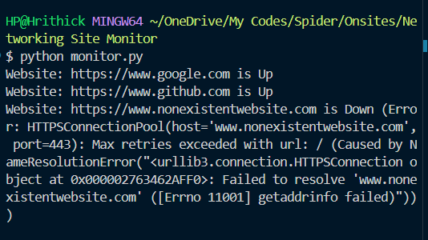

requests is a python library that helps me make HTTP requests.
here to check the status of any website.

In the provided code, we have a Python script called `monitor.py` that utilizes the `requests` library to check the status of websites.

The `check_website_status` function takes a URL as input and sends an HTTP GET request to that URL using `requests.get()`. It then checks the status code of the response. If the status code is 200, it means the website is up and running, so the function returns "Up". Otherwise, it returns "Down" along with the status code.

The `urls` list contains the URLs of the websites that we want to monitor. In this case, it includes "https://www.google.com", "https://www.github.com", and "https://www.nonexistentwebsite.com".

The script then iterates over each URL in the `urls` list and calls the `check_website_status` function for each URL. The returned status is printed along with the corresponding website URL using the `print` function.

To run this script, you need to have the `requests` library installed. You can install it using pip:

```
pip install requests
```

Make sure to replace the URLs in the `urls` list with the ones you want to monitor.


